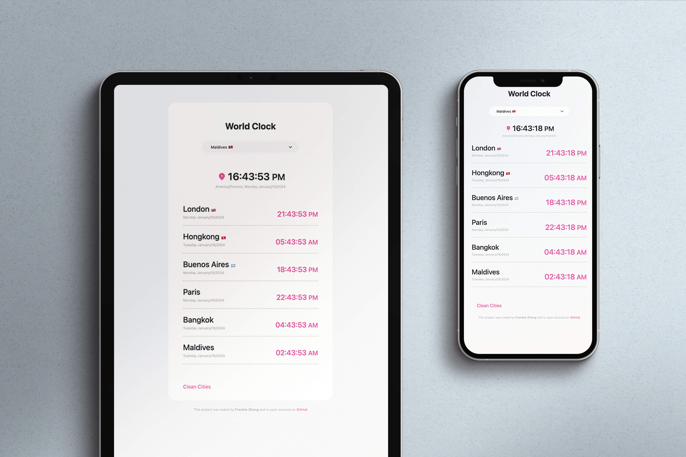

# World Clock App 📖

 

Shows real-time time in different cities around the world.

## Technologies / Tool Used 🛠
- HTML & CSS
- Bootstrap
- Moment.js
- Figma

## Try It Out 
To see the app in action, visit [Simple Dictionary App]([https://simpledictionarysite.netlify.app/]( https://simpledictionarysite.netlify.app/ ). 

## Getting Started 
1. Clone this repository: `git clone https://github.com/your-username/your-repo.git`
2. Install the required dependencies: `npm install`
3. Run the app locally: `npm start`

## Color Reference 🎨
| Color           | Hex      |
| --------------- | -------- |
| Dark Grey       |  #232323  |
| Grey            | #ABABAB  |
| Pink            | #E55095  |
| white           | #ffffff  |

Feel free to explore and contribute to this project. If you have any suggestions or find issues, please create a GitHub issue.
